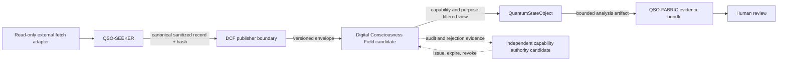

# QSO-DIGITALIS

QSO-DIGITALIS is a **documentation and architecture candidate** for a bounded Digital Consciousness Field (DCF): a capability-scoped, content-addressed evidence-exchange contract between QSO-SEEKER, QuantumStateObjects, and QSO-FABRIC.

> **Current status: review only.** Draft PR #2 proposes the charter and scaffold plan. No field runtime, transport, storage service, signing authority, network integration, accepted schema contract, or deployment is approved.

The term **Digital Consciousness Field** is architectural. It describes a shared evidence-coordination boundary and does not claim literal consciousness, awareness, sentience, independent agency, or unrestricted shared memory.

## Proposed responsibility

QSO-DIGITALIS is intended to define how authorized publishers and subscribers exchange immutable references to sanitized evidence without collapsing retrieval, runtime, orchestration, governance, and canonical-state responsibilities into one repository.

A future accepted contract would cover:

- content-addressed field envelopes and evidence references;
- topics, queries, responses, acknowledgements, tombstones, and revocations;
- publisher and subscriber capability separation;
- purpose, sensitivity, retention, expiry, and experiment-scope filtering;
- deterministic canonicalization and tamper detection;
- provenance links, replay evidence, and access records;
- fail-closed schema, version, identity, capability, and hash validation;
- bounded local reference behavior before any external transport is considered.

## Repository relationships

| Repository | Proposed relationship | Boundary |
|---|---|---|
| `QSO-SEEKER` | Publishes references to canonical sanitized records | Seeker owns retrieval, sanitization, rejection, and canonical record creation; DCF must not ingest raw network responses or execute content. |
| `QuantumStateObjects` | Consumes immutable capability-filtered evidence views | QSOs receive bounded read-only records and cannot broaden their own permissions or mutate canonical evidence. |
| `QSO-FABRIC` | Records evidence access and assembles experiment bundles | Fabric owns bounded experiment orchestration; DCF does not own QSO reasoning, goals, or conclusions. |
| Repository `0` | May prepare proposals, schemas, fixtures, and evidence | Proposal generation does not confer approval, capability issuance, or canonical-state authority. |
| Repository `1` or an approved successor | Candidate authority for capability and canonical transition decisions | QSO-DIGITALIS must not issue its own consequential capabilities or become an independent trust root. |
| `qso-field.github.io` | May document accepted contracts and limitations | Publication does not convert a proposal into an implemented or released capability. |

## Candidate evidence flow

Every edge above remains proposed until the owning repositories accept compatible immutable contracts and deterministic fixtures.

## Safety and trust boundary

The candidate must remain:

- non-executing: records are inert data and never imported, evaluated, compiled, shelled, or treated as instructions;
- deny-by-default: missing identity, schema, version, capability, purpose, sensitivity, retention, or hash evidence produces no access;
- capability-scoped: publish, discover, subscribe, read, acknowledge, and revoke are separate permissions;
- content-addressed: accepted records and envelopes are bound to deterministic digests;
- provenance-preserving: every transformation, access, rejection, revocation, and replay retains attribution;
- privacy-limited: data classes, consent, purpose limitation, retention, deletion, and public/private boundaries must be approved before use;
- bounded: record size, topic count, subscription count, storage, time, rate, and replay depth have explicit limits;
- reversible: contracts, fixtures, migrations, disablement, and rollback evidence precede promotion;
- human-reviewed: evidence access does not automatically promote a conclusion or authorize an external action.

## Explicit non-capabilities

QSO-DIGITALIS currently does not provide or authorize:

- raw network, credential, archive, package, binary, or Git-object transport;
- arbitrary code execution, shell access, package installation, or generated-code execution;
- unrestricted shared memory or implicit trust between QSOs;
- autonomous approval, repository writes, protected-branch changes, release, deployment, or infrastructure control;
- wallet custody, transaction signing, payments, settlement, or financial authority;
- persistent multi-user service, production storage, schedules, or external network endpoints;
- literal consciousness, sentience, awareness, or independent legal identity.

## Review path

The only active task is disposition of the charter candidate:

1. approve a unique non-overlapping DCF responsibility;
2. request bounded corrections to purpose, contracts, trust, privacy, retention, licensing, provenance, migration, or rollback; or
3. retire/archive the repository and transfer any useful concepts to an accepted owner.

Implementation remains blocked until the charter is approved and accepted versioned schemas, policies, migrations, positive and negative fixtures, tests, security/privacy/license review, exact-head CI evidence, downstream compatibility, provenance, and rollback artifacts exist.

## Documentation

- [Architecture candidate](docs/architecture.md)
- [Task chain](taskchain.md)
- [Release plan](release.md)
- [Punch list](punchlist.md)
- [Changelog](changelog.md)

## Scaffold rule

The roadmap manifest and scaffold materializer are proposal tools only. Dry-run output and generated placeholders are not implementation evidence. Do not run materialization in write mode or treat generated files as accepted contracts without explicit charter approval and review.
