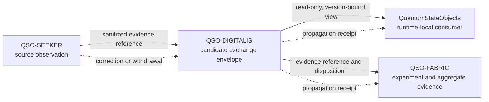

# Architecture and Trust Boundaries

## Status

`PROPOSED — DOCUMENTATION ONLY`

This architecture describes a reviewable boundary. It does not accept a namespace, schema, adapter, storage model, implementation, or deployment.

## Candidate context

**Equivalent prose:** QSO-SEEKER may produce a sanitized, immutable reference to observed source material. A proposed QSO-DIGITALIS envelope could describe how that reference is scoped, versioned, retained, corrected, or withdrawn. QuantumStateObjects could consume a read-only, exact-version view for runtime-local reasoning, while QSO-FABRIC could reference the same source in experiment evidence. Corrections and withdrawals must propagate to every registered consumer and produce explicit receipts. No arrow grants write authority, semantic acceptance, or operational control.

## Candidate layers

### 1. Source binding

Records must identify an immutable source tuple and distinguish original bytes, canonicalized representations, interpretations, and summaries. Missing or mutable source identity fails closed.

### 2. Envelope identity

A future envelope would require an exact schema version, canonicalization profile, namespace, record identifier, content digest, creation context, and supersession status. A version label alone is insufficient.

### 3. Policy labels

Sensitivity, purpose, retention, access, correction, revocation, and human-review requirements must be explicit and non-broadening. Missing policy labels cannot be replaced by permissive defaults.

### 4. Consumer binding

Each consumer must declare the accepted generation, purpose, fields used, unsupported fields, correction behavior, withdrawal behavior, migration path, and rollback route. A successful parse is not semantic compatibility.

### 5. Evidence and receipts

Acknowledgments, access records, correction receipts, withdrawal receipts, migration evidence, and rollback evidence remain distinct. Receipt of a record is not acceptance of its meaning or truth.

## Trust boundaries

- **Source repository boundary:** the source repository remains authoritative for its own records.
- **Exchange boundary:** QSO-DIGITALIS may describe transfer metadata but cannot silently reinterpret source meaning.
- **Consumer boundary:** consumers must fail closed on unknown versions, invalid digests, unsupported semantics, or stale corrections.
- **Governance boundary:** CI, documentation, or mergeability cannot appoint owners or approve architecture.
- **Human review boundary:** `QSO-CONSENT-CAPACITY-LOCK-v1` and explicit human review remain mandatory where applicable.

## Failure modes

| Failure | Required disposition |
|---|---|
| Mutable or missing source identity | Reject and preserve a diagnostic |
| Namespace or record-role collision | Block compatibility claim |
| Parser success without semantic agreement | Record as syntactic-only evidence |
| Correction reaches only some consumers | Keep global state blocked |
| Withdrawal leaves a current public route | Mark withdrawal incomplete |
| Consumer uses unsupported fields | Reject or migrate explicitly |
| Retention expires without disposition | Withdraw dependent currentness claims |
| Rollback restores stale or withdrawn state | Reject rollback and preserve evidence |
| Owner or custodian is missing | Record an explicit vacancy |

## Architectural obstruction

The portfolio still contains overlapping meanings for event-ledger and runtime-report concepts across runtime-local and Fabric-level records. QSO-DIGITALIS cannot resolve that collision by introducing another alias. Any approved charter must use role-specific record families or remain blocked until namespace and semantic ownership are decided.

## Rollback model

A documentation or contract rollback must restore a previously supported generation or an explicit held/withdrawn state. It must not reintroduce expired evidence, unsupported aliases, revoked access, withdrawn claims, or a consumer generation that cannot process current corrections.
