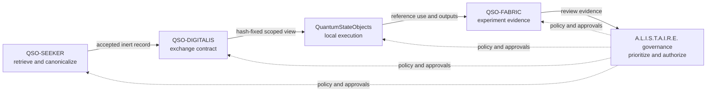

# Architecture

## Architectural status

QSO-DIGITALIS is currently a **decision boundary**, not an operating service. The accepted repository surface consists of planning records and an immutable consent-capacity control. Draft PR #2 proposes a Digital Consciousness Field (DCF) contract and scaffold, but that proposal is not part of `main` and has not passed the P0 charter gate.

The term *Digital Consciousness Field* is an architectural name for a coordination contract. It does not assert awareness, sentience, personhood, or independent authority.

## Candidate system context

The candidate architecture separates evidence preparation, exchange, local use, experiment recording, and governance:

## Responsibility boundary

### QSO-DIGITALIS may own, after approval

- field envelope and evidence-reference schemas;
- topic and capability vocabulary;
- purpose, sensitivity, retention, revocation, replay, and acknowledgment semantics;
- deterministic content-addressing and canonicalization rules for the exchange layer;
- publisher and subscriber conformance fixtures;
- migration and compatibility rules for the contract;
- evidence required to prove that a local reference implementation conforms.

### QSO-DIGITALIS does not own

- retrieval adapters, crawling, source acceptance, or source licensing decisions;
- QSO cognition, model execution, memory, identity, or genome behavior;
- experiment orchestration or evaluation policy;
- portfolio prioritization, repository credentials, merge authority, releases, deployment, or emergency governance;
- raw secrets, executable packages, binaries, Git objects, unrestricted shared state, or direct external mutation;
- conclusions, legal determinations, payments, settlement, or physical-world action.

## Candidate logical components

These components describe an approval target, not current implementation.

| Component | Responsibility | Required evidence before acceptance |
|---|---|---|
| Envelope validator | Validate version, identity, hashes, policy metadata, and required references | Schemas, positive and negative fixtures, deterministic validator tests |
| Capability evaluator | Distinguish publish, discover, subscribe, read, acknowledge, revoke, and administer | Denial-first matrix, isolation tests, expiry and revocation tests |
| Topic and purpose filter | Restrict records to approved topic, purpose, sensitivity, source class, and experiment | Boundary fixtures and unauthorized-crossing tests |
| Content store interface | Address immutable records and tombstones by hash | Canonicalization specification, duplicate and tamper tests |
| Provenance verifier | Traverse source-to-record and record-to-use links | Broken-chain, substitution, replay, and migration fixtures |
| Retention/revocation engine | Enforce expiry, tombstones, revocation, and evidence preservation | Clock-controlled tests and recovery procedures |
| Local transport adapters | Provide bounded in-memory and filesystem conformance paths | Network-disabled tests, path confinement, limits, cleanup evidence |
| Audit evidence writer | Record policy decisions without secrets | Schema, redaction tests, append-only evidence expectations |

## Candidate lifecycle

1. A publisher presents an already accepted, canonical, non-executable evidence record and metadata.
2. The exchange boundary validates publisher identity, schema version, content hash, capability, purpose, sensitivity, and retention policy.
3. The record reference becomes discoverable only to explicitly scoped subscribers.
4. A subscriber requests a view bound to its purpose and experiment scope.
5. The boundary returns immutable references or bounded records; unknown or invalid states fail closed.
6. Access, acknowledgment, rejection, expiry, and revocation produce auditable evidence.
7. Downstream experiment evidence preserves the exact contract version and hashes used.
8. Human review remains required before any consequential conclusion or action is promoted.

## Trust boundaries

- **External source to SEEKER:** untrusted input; outside this repository.
- **SEEKER to exchange publisher:** accepted records only; publisher conformance still verified.
- **Exchange boundary:** policy enforcement and reference integrity; no implicit QSO trust.
- **Exchange to subscriber:** least-privilege, purpose-bound read view.
- **Subscriber to FABRIC:** outputs and reference-use evidence remain untrusted until evaluated.
- **Portfolio governance:** separate approval and operational authority; never inherited from a field record.

## First permissible implementation target

Only after P0 charter approval and P1 contract acceptance may a first implementation be considered. The target must be local, disposable, credential-free, network-disabled, bounded in records and time, synthetic-data-only, and incapable of external writes. A scaffold generator or placeholder directory tree is not implementation evidence.
