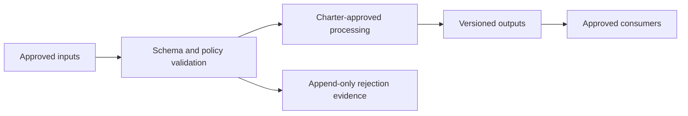

# QSO-DIGITALIS Charter Decision

QSO-DIGITALIS is on architectural hold. The repository name is not sufficient evidence of purpose, and no implementation scope is authorized until this decision record is approved and reflected in `README.md`, `taskchain.md`, `release.md`, and `changelog.md`.

## Decision status

**Status:** approval required  
**Implementation authorization:** none  
**First possible release:** documentation-only charter candidate after approval

## Required decisions

### 1. Purpose

State the single primary problem this repository owns. The purpose should be narrow enough that another QSO repository does not share the same responsibility.

**Approved purpose:** _pending_

### 2. Target users

Identify who validates, produces, or consumes its artifacts.

**Approved users:** _pending_

### 3. Inputs

List every accepted input class, including whether it is public, private, sensitive, executable, network-derived, or generated by another repository.

| Input | Producer | Data classification | Validation rule |
|---|---|---|---|
| _pending_ | _pending_ | _pending_ | _pending_ |

### 4. Outputs

List every artifact the repository is permitted to emit, its schema/versioning requirements, and intended consumers.

| Output | Consumer | Contract/version | Evidence requirement |
|---|---|---|---|
| _pending_ | _pending_ | _pending_ | _pending_ |

### 5. Non-goals and prohibited capabilities

At minimum, decide whether the repository is prohibited from:

- executing untrusted content;
- holding credentials or unrestricted network access;
- importing executable behavior from other repositories;
- modifying immutable QSO constraints;
- moving funds, holding custody, or authorizing production settlement;
- collecting personal or sensitive data;
- making unsupported claims about autonomy or consciousness.

**Approved non-goals:** _pending_

### 6. Trust boundary

Describe where untrusted data enters, what validation occurs, which component has authority, and how failures are recorded. The design must fail closed on missing schemas, unsupported versions, altered hashes, or ambiguous provenance.

**Approved trust boundary:** _pending_

### 7. Portfolio relationship

Choose exactly one relationship model:

- upstream contract publisher;
- downstream consumer;
- adapter or integration boundary;
- documentation-only repository;
- independent research repository;
- other explicitly defined role.

Dependencies must identify schema versions, canonical hashes, failure behavior, and whether code import is prohibited.

**Approved relationship:** _pending_

### 8. Data classification and privacy

Define allowed data classes, retention, redaction, public-fixture rules, personal-identifier restrictions, and whether public repository visibility is appropriate.

**Approved data model:** _pending_

### 9. License and notices

Choose a license and any attribution, confidentiality, export, or third-party notice requirements consistent with public visibility.

**Approved license/notice model:** _pending_

### 10. Verification strategy

Define the minimum deterministic checks for the charter candidate and later implementation candidates.

A complete strategy should include:

- schema and negative-fixture validation;
- unit, integration, and smoke tests where applicable;
- dependency, secret, and workflow-permission checks;
- documentation and link checks;
- provenance with commands, tool versions, hashes, and candidate commit;
- artifact checksums and rollback criteria.

**Approved verification strategy:** _pending_

## Candidate architecture template

The architecture must be filled only after the purpose decision:

## Approval checklist

- [ ] Purpose is specific and non-duplicative.
- [ ] Target users are identified.
- [ ] Inputs and outputs are classified and versioned.
- [ ] Non-goals and prohibited capabilities are explicit.
- [ ] Trust and failure boundaries are documented.
- [ ] Portfolio dependencies are directional and hash-verifiable.
- [ ] Privacy, public visibility, license, and notices are approved.
- [ ] Verification, artifacts, provenance, and rollback are defined.
- [ ] `README.md`, `taskchain.md`, `release.md`, and `changelog.md` are updated consistently.

Until every item is approved, Builders must not create schemas, runtime code, adapters, workflows, or capability claims in this repository.
