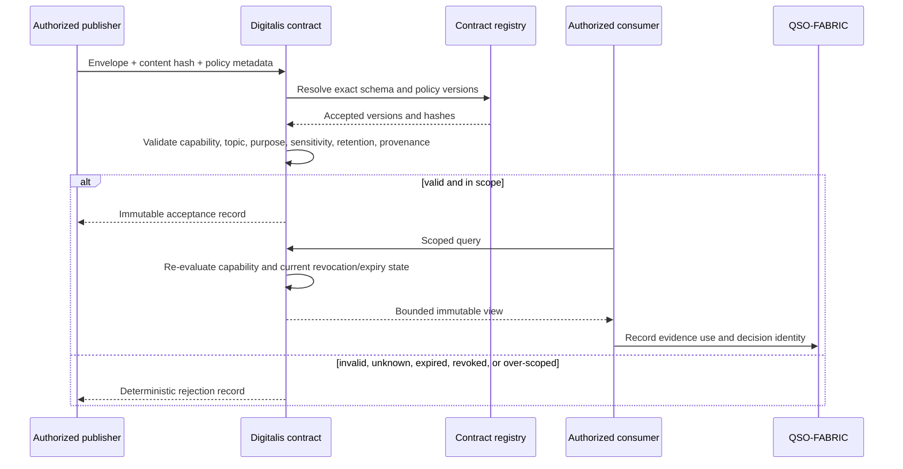
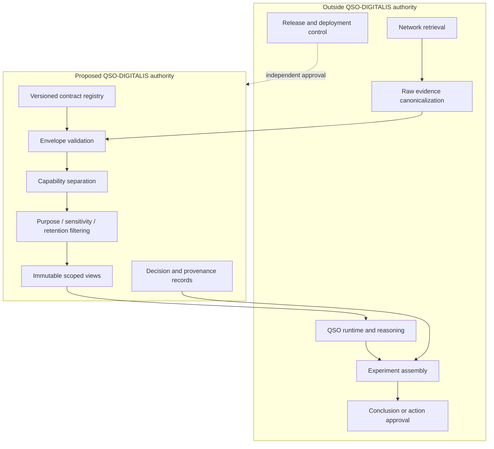
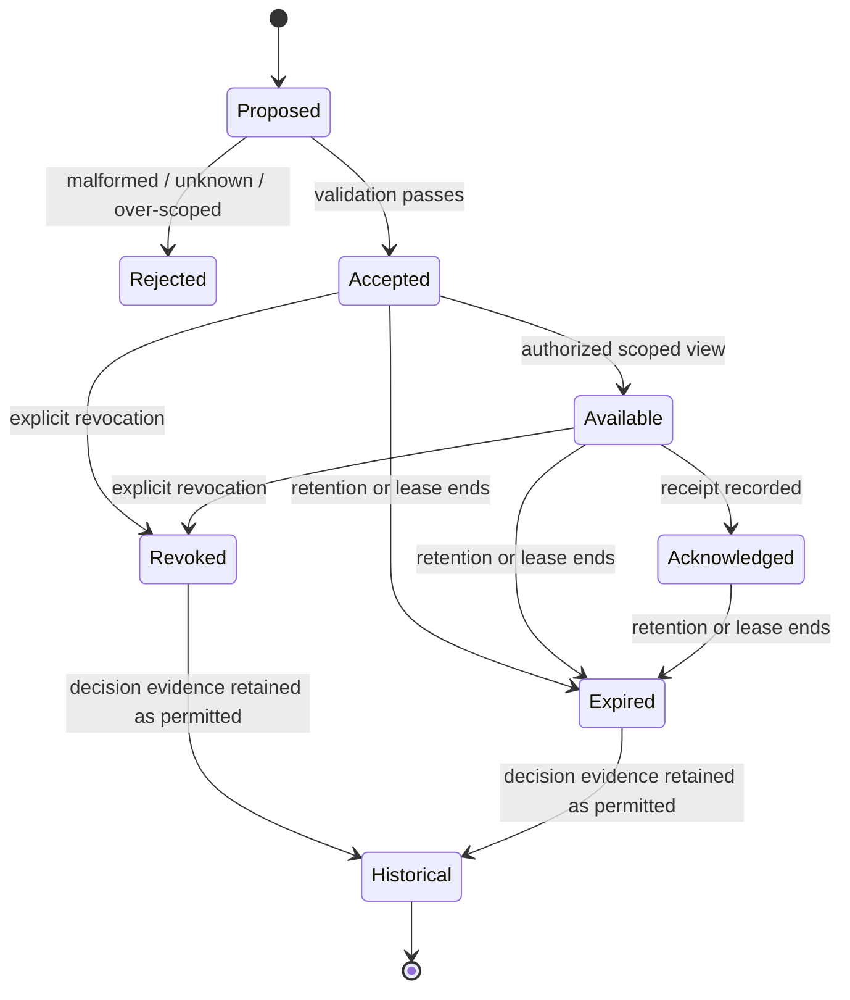
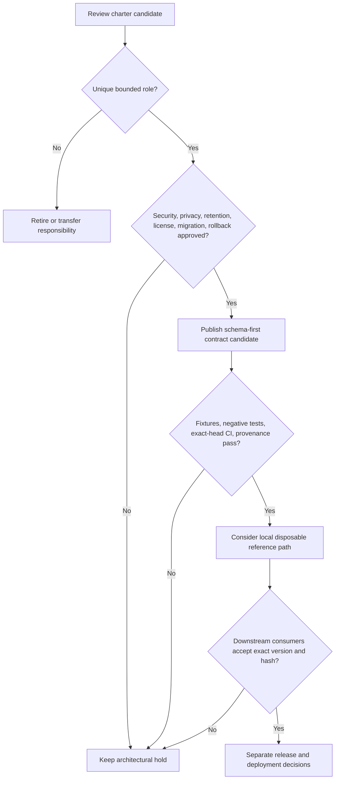

# Architecture diagrams

These diagrams describe the charter candidate only. They do not indicate that a field runtime, transport, datastore, or deployment exists.

## Portfolio responsibility map

```mermaid
flowchart LR
    Source[External source] -->|isolated retrieval| Seeker[QSO-SEEKER]
    Seeker -->|canonical inert evidence + hash| Publisher[Publisher adapter]
    Publisher -->|proposed envelope| Digitalis[QSO-DIGITALIS contract]
    Digitalis -->|capability-scoped read view| QSO[QuantumStateObjects]
    QSO -->|evidence use| Fabric[QSO-FABRIC]
    Fabric -->|review bundle| Human[Human reviewer]

    Digitalis -. does not own .-> Source
    Digitalis -. does not execute .-> QSO
    Digitalis -. does not approve .-> Human
```

## Proposed validation path

## Authority boundaries

## Record lifecycle

## Release decision flow

