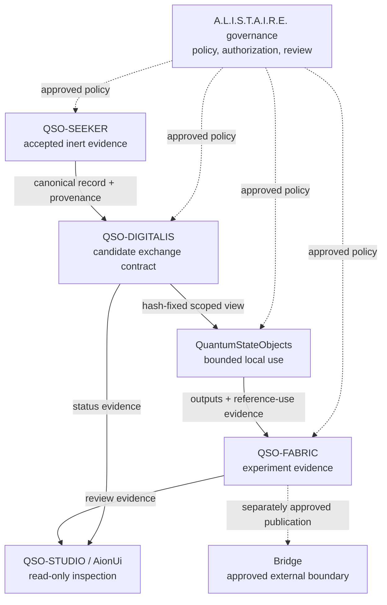
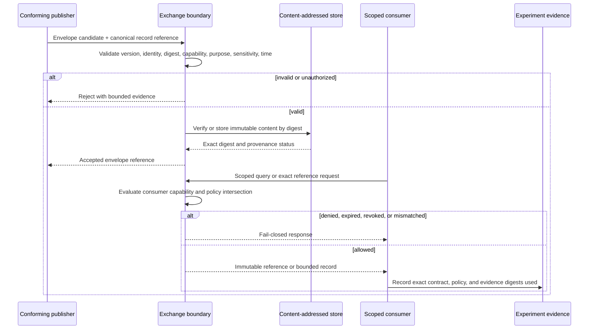
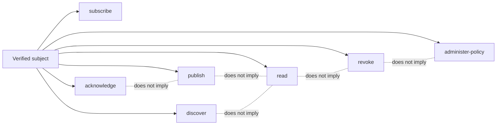
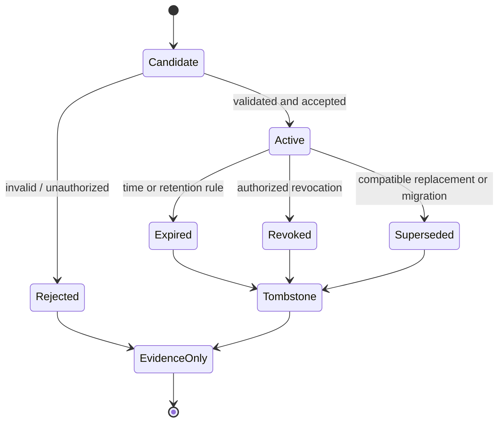
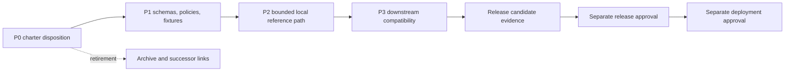
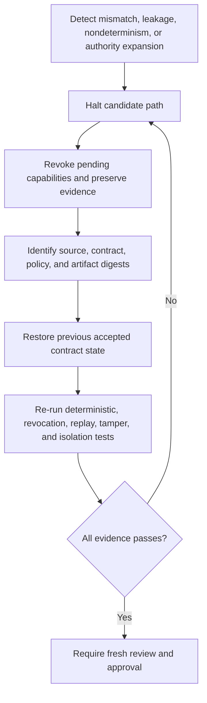

# Diagrams

These diagrams describe the charter candidate and its required controls. They do not claim an implemented service.

## Portfolio context

## Candidate publish-and-read sequence

## Capability separation

## Trust boundaries

```mermaid
flowchart LR
    U[Untrusted external source] -->|outside repository| S[QSO-SEEKER boundary]
    S -->|accepted record candidate| P[Publisher conformance boundary]
    P -->|validated envelope| D[QSO-DIGITALIS policy boundary]
    D -->|least-privilege view| Q[Consumer boundary]
    Q -->|untrusted output + exact references| F[QSO-FABRIC evaluation boundary]
    F -->|evidence only| H[Human review and governance]

    classDef boundary stroke-width:3px;
    class S,P,D,Q,F,H boundary;
```

## Record lifecycle

## Release gates

## Incident and rollback

