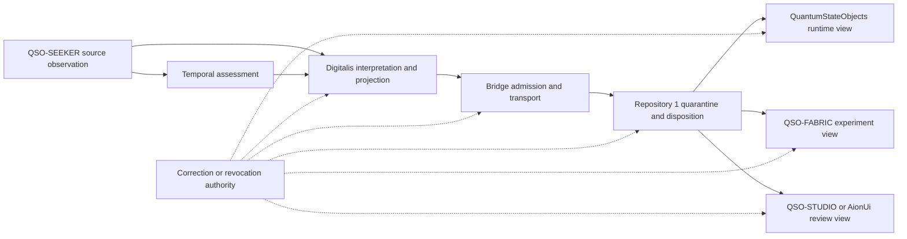

# Obstruction and gluing register

## Status

`REVIEW — CONTRACT GRAPH UNRESOLVED`

This register identifies where QSO-DIGITALIS cannot yet compose safely with the A.L.I.S.T.A.I.R.E. repository portfolio. It is documentation and systems analysis only. It does not approve the charter, establish a schema package, create a runtime or store, authorize transport, issue capabilities, accept evidence as true, or make any record canonical.

The analysis is preservation-safely reconstructed from historical source lineage `muse/qso-digitalis-docs-2026-07-20@37b00a30f5b6f3df719e3884f7c1c8e79dd796a8` and reconciled with the current charter/retirement candidate. The historical branch remains preserved; this descendant requires fresh exact-head evidence.

## Method

Treat each repository as a local section with a bounded responsibility and each accepted versioned contract as a gluing map. Pairwise compatibility is necessary but not sufficient. A route is acceptable only when shared fixtures show that identity, canonicalization, loss, purpose, privacy, authority, correction, revocation, migration, rollback, and recovery agree on every relevant overlap.

This is a practical engineering compatibility method, not a claim that a complete mathematical homology or cohomology computation has been performed.

## Lowest-coupling candidate boundary

The narrowest Digitalis candidate is:

> QSO-DIGITALIS documents non-executing, content-addressed interpretation, policy-projection, and exchange-envelope profiles for accepted evidence. It preserves source identity and lineage, references separately governed temporal assessments, declares every transformation, and produces purpose-limited consumer views.

Under this candidate:

- QSO-SEEKER owns retrieval, sanitization, source attribution, and inert source observations;
- an accepted temporal authority owns clock identity, ordering, freshness, expiry, uncertainty, and replay assessment;
- QSO-DIGITALIS owns no generic authority and could own only its accepted profile-specific interpretation/projection semantics;
- Bridge owns separately accepted admission, transport, transformation, and delivery-receipt semantics;
- Repository `1` is the candidate independent quarantine, capability, disposition, correction, revocation, checkpoint, and recovery authority;
- QuantumStateObjects and QSO-FABRIC consume exact accepted versions and hashes under separate capabilities;
- QSO-STUDIO and AionUi present distinct states without becoming authority.

## Route under review

**Equivalent prose:** QSO-SEEKER produces a distinct source observation. A separately governed temporal assessment may accompany it. Digitalis may create a derived interpretation and purpose-limited projection without changing either input. Bridge may admit and transport an inert artifact while producing a separate receipt. Repository `1` then performs an independent quarantine or disposition before any runtime, experiment, or review interface receives a bounded view. Corrections and revocations must reach every derived, transported, disposed, cached, and displayed state; any unverified propagation leaves the affected route blocked.

## Active obstruction ledger

| ID | Obstruction | Failure mode | Fail-closed repair candidate |
|---|---|---|---|
| `O-DIG-01` | Source and interpretation identity collapse | Derived claims appear to be source evidence | Separate typed IDs, immutable source references, domain-separated digests, explicit display labels |
| `O-DIG-02` | Temporal authority overlap | Digitalis freshness or replay decisions conflict with another owner | Accept typed external temporal assessments under one approved authority |
| `O-DIG-03` | Generic envelope ownership conflict | Digitalis, Seeker, Bridge, Genome, Fabric, and Repository `1` define incompatible envelopes | Designate a neutral registry; each repository owns only its accepted profile |
| `O-DIG-04` | Exchange and transport overlap | “Field exchange” is interpreted as generic network authority | Digitalis emits inert envelopes; Bridge owns approved transport profiles |
| `O-DIG-05` | Derived storage versus canonical state | A cache is mistaken for Repository `1` canonical state | Label storage as non-authoritative derived-artifact storage or prohibit it |
| `O-DIG-06` | Projection mistaken for capability | A purpose-limited view is treated as authority to act | Carry explicit non-authority declarations and separate capability records |
| `O-DIG-07` | Privacy downgrade | Derivation, redaction, or aggregation weakens source restrictions or reveals protected facts | Most-restrictive-policy inheritance and inference-aware privacy fixtures |
| `O-DIG-08` | Correction and cache divergence | Corrected or revoked records remain active downstream | One propagation contract with bounded acknowledgment and freeze semantics |
| `O-DIG-09` | Consciousness terminology ambiguity | Repository naming implies sentience, personhood, or authority | Preserve explicit architectural non-claims or rename through P0 disposition |
| `O-DIG-10` | Subject namespace mismatch | Components bind one record to different subjects | Typed namespaces, owned crosswalks, and ambiguous-alias rejection |
| `O-DIG-11` | Canonicalization disagreement | Equal records hash differently or unequal records appear equal | Accepted canonicalization IDs, domain tags, exact versions, and golden vectors |
| `O-DIG-12` | Transformation opacity | Normalization, redaction, aggregation, derivation, or repackaging is hidden | Field-level transformation declarations and replay fixtures |
| `O-DIG-13` | Vocabulary and reason-code drift | Completion, confidence, rejection, and uncertainty meanings diverge | Versioned vocabularies and explicit mappings; never coerce `UNKNOWN` to success |
| `O-DIG-14` | Freshness and replay-domain ambiguity | A valid digest is stale, duplicated, or replayed on another route | Bind clock source, uncertainty, replay domain, sequence/nonce, and expiry |
| `O-DIG-15` | Consumer and purpose mismatch | A valid projection is used by the wrong consumer or for another purpose | Bind consumer, purpose, sensitivity, action class, expiry, and exact digest |
| `O-DIG-16` | Partial-state collapse | A global success flag hides unsupported or incomplete evidence | Per-claim completion, evidence, time, limitations, and reason codes |
| `O-DIG-17` | License and retention loss | Derived artifacts exceed source terms or outlive allowed retention | Preserve source license, expiry, hold, deletion/tombstone, and disclosure constraints |
| `O-DIG-18` | Emergency-stop and recovery gap | Frozen evidence continues to be projected, transported, admitted, or consumed | Independent stop, cache freeze, recovery approval, and bounded replay evidence |
| `O-DIG-19` | Runtime/Fabric role collision | Runtime-local records and Fabric aggregate records use overlapping identities or namespaces | Preserve distinct semantic classes, owners, receipts, ordering, and correction paths |
| `O-DIG-20` | Historical-lineage substitution | Preserved PR #5 or PR #2 evidence is represented as current validation | Bind every claim to exact source head and mark superseded or historical generations explicitly |

## Pairwise gluing requirements

### QSO-SEEKER → Digitalis

Required witnesses:

- accepted source profile, producer identity, canonical bytes, and digest;
- malformed, unsupported-version, wrong-producer, and wrong-record-type rejection;
- partial and unsupported collection preservation;
- hostile-input metadata, sensitivity, license, and retention preservation;
- correction, supersession, and revocation linkage;
- proof that interpretation does not mutate source evidence.

### Temporal authority → Digitalis

Required witnesses:

- accepted clock identity, freshness, uncertainty, ordering, and replay assessment;
- stale, mismatched, and conflicting-clock rejection;
- duplicate-versus-replay distinction;
- no silent timestamp replacement or policy override.

### Digitalis → Bridge

Required witnesses:

- exact profile and envelope acceptance;
- canonical-byte and lineage verification;
- undeclared-transformation rejection;
- privacy downgrade, wrong route, wrong consumer, expiry, and revocation rejection;
- transport transformation remains distinct from interpretation.

### Bridge → Repository `1`

Required witnesses:

- delivery receipt never equals canonical acceptance;
- duplicate-delivery deduplication;
- partial delivery, retry, correction, and rollback semantics;
- subject, policy, lineage, and transformation verification;
- correction and revocation propagation.

### Repository `1` → consumers

Required witnesses:

- exact disposition, capability, consumer, purpose, version, and digest binding;
- expired or revoked capability rejection;
- consumption receipt without canonical self-promotion;
- cache invalidation and re-evaluation after correction or revocation;
- interface display cannot create authority.

## Required triple-overlap witnesses

1. **Seeker → temporal authority → Digitalis:** source, subject, clock, freshness, replay, and limitation identities remain coherent.
2. **Seeker → Digitalis → Bridge:** source bytes and lineage remain verifiable while every derived and transport transformation is declared.
3. **Digitalis → Bridge → Repository `1`:** transport success remains distinct from quarantine admission and disposition.
4. **Digitalis → Repository `1` → QuantumStateObjects:** a runtime view binds the exact accepted envelope, policy, capability, consumer, and expiry.
5. **Digitalis → Repository `1` → QSO-FABRIC:** experiment evidence references accepted records without converting experiment outcomes into source truth.
6. **Correction authority → Digitalis → Bridge/Repository `1`:** correction and revocation invalidate projections, caches, receipts, and dispositions consistently.
7. **Repository `1` → QSO-STUDIO/AionUi → human review:** interfaces preserve source, interpretation, projection, transport, disposition, and approval as separate states.
8. **Emergency stop → Digitalis → downstream consumers:** frozen records cannot be newly projected, transported, admitted, or consumed before explicit recovery.

## Acceptance evidence

No edge or overlap is accepted until it has:

- one named semantic owner and one independent reviewer, or an explicit blocking vacancy;
- immutable schema/profile versions and canonicalization identifiers;
- positive, negative, malformed, unsupported-version, wrong-subject, stale, replay, privacy, partial-state, correction, revocation, freeze, migration, rollback, and failed-rollback fixtures;
- matching golden vectors in every participating repository;
- exact-head CI results and retained evidence;
- migration, deprecation, retirement, and restoration rules;
- named privacy, licensing, incident, emergency-stop, recovery, accessibility, publication, and release owners or vacancies.

## Architectural decisions required

P0.2 must explicitly decide:

1. whether QSO-DIGITALIS remains active, is split into a neutral contract package, is renamed, migrates its useful concepts, or is retired;
2. the generic envelope/profile-registry owner;
3. source, subject, temporal, interpretation, projection, transport, disposition, runtime, Fabric, and consumer namespaces;
4. canonicalization, digest domains, signing references, clocks, replay domains, vocabularies, and reason-code ownership;
5. whether Digitalis may own a local derived-artifact cache or only documentation and profiles;
6. privacy, source-license, retention, correction, revocation, invalidation, freeze, recovery, accessibility, support, and incident authority;
7. the exact Seeker → temporal/Digitalis → Bridge → Repository `1` route;
8. migration, rollback, publication, release, deployment, and retirement ownership.

The safe route remains blocked until these decisions and witnesses exist.

## FYSA-120 capability map

Applied capabilities:

- `011-B` and `011-E` for accessible route visualization and prose equivalence;
- `012-A`, `012-B`, `012-D`, and `012-E` for document architecture, contract exposition, terminology controls, and lifecycle synchronization;
- `013-A`, `013-C`, `013-D`, and `013-E` for graph construction, entity resolution, obstruction detection, and provenance-aware updating;
- `017-C`, `017-D`, and `017-E` for lineage, version-substitution detection, preservation, and correction propagation;
- `018-B`, `018-D`, and `018-E` for responsibility mapping, reviewer continuity, and contested-history preservation;
- `031-A`, `031-D`, and `031-E` for acceptance criteria, hostile integration fixtures, regression prevention, and assurance maintenance;
- `040-A`, `040-B`, `040-D`, and `040-E` for system archaeology, dependency risk, migration, rollback, and continuity assurance.

Proposed non-authoritative subdivision:

**`032-N — cross-repository obstruction ledgers, triple-overlap witnesses, and correction-closed gluing paths for evidence systems`**

Taxonomy mapping records required capabilities only. It does not establish competence, appointment, ownership, acceptance, or authority.

## Scope boundary

This register adds documentation only. It does not revive historical PR #2 or PR #5 as current implementation candidates, materialize a scaffold, establish schemas, create records, fetch external data, transport artifacts, store private data, sign content, issue credentials or capabilities, publish Pages, release a package, deploy a service, or change repository settings.
