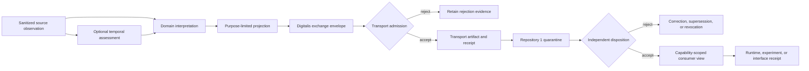

# Source-observation interpretation and exchange profile

## Status

`PROPOSED_PROFILE — DOCUMENTED_NOT_ACCEPTED`

This document describes one bounded candidate role for QSO-DIGITALIS. It does not approve the repository charter, appoint a contract owner, accept a schema or namespace, create a runtime or store, authorize transport, issue capabilities, promote evidence to truth, or make any record canonical.

The profile is preservation-safely reconstructed from historical documentation lineage `muse/qso-digitalis-docs-2026-07-20@37b00a30f5b6f3df719e3884f7c1c8e79dd796a8`. The historical branch remains the provenance source; this document is the current review surface and requires fresh exact-head validation.

## Problem

The portfolio separates several responsibilities:

- QSO-SEEKER retrieves, sanitizes, attributes, and emits inert source observations;
- an accepted temporal authority would interpret clock identity, ordering, freshness, expiry, and replay risk;
- Bridge may carry approved artifacts and produce delivery evidence;
- Repository `1` is the candidate independent quarantine, capability, disposition, revocation, checkpoint, and recovery authority;
- QuantumStateObjects and QSO-FABRIC consume accepted evidence under separate runtime or experiment rules;
- QSO-STUDIO and AionUi present evidence and review state without becoming authority.

A missing interface remains between an immutable source observation and a consumer-ready, purpose-limited evidence view. Without distinct identities, one record can be misread simultaneously as source evidence, temporal judgment, domain interpretation, disclosure policy, delivery success, canonical disposition, and displayed approval.

That collapse is a composition obstruction. Transport success can appear to establish truth; a derived interpretation can overwrite source evidence; a projection can be treated as a capability; or interface state can be mistaken for authorization.

## Candidate responsibility

The lowest-authority candidate is for QSO-DIGITALIS to document a non-executing, content-addressed **interpretation and policy-projection profile** that:

- references immutable source observations without replacing them;
- carries separately identified temporal, domain, quality, and uncertainty assessments;
- produces purpose-, sensitivity-, retention-, and consumer-limited projections;
- binds every derived artifact to exact inputs, profile versions, transformations, and digests;
- carries correction, supersession, revocation, freeze, and recovery references;
- exposes deterministic records for independent validation by transport, disposition, runtime, experiment, and review components.

This role would not own retrieval, source truth, temporal truth, generic transport, credentials, canonical state, runtime execution, experiment conclusions, interface approval, publication, release, or deployment.

## Identity separation

| Record identity | Meaning | Candidate source | Must not imply |
|---|---|---|---|
| `source_record_id` | Immutable sanitized source observation | QSO-SEEKER or approved producer | Truth, freshness, permission, or canonical acceptance |
| `temporal_assessment_id` | Clock, ordering, freshness, expiry, and replay assessment | Accepted temporal authority | Domain truth or authorization |
| `interpretation_id` | Domain-specific derived assessment | Named interpretation-profile owner | Mutation of source evidence |
| `projection_id` | Purpose- and consumer-limited deterministic view | Candidate Digitalis profile | Additional rights or capability issuance |
| `exchange_envelope_id` | Content-addressed package of typed references and policy declarations | Candidate Digitalis profile | Delivery, truth, or canonical admission |
| `transport_artifact_id` | Artifact admitted to an accepted transport profile | Bridge or approved transport | Disposition or permission |
| `delivery_receipt_id` | Evidence of a bounded delivery attempt and result | Transport provider | Content correctness or downstream acceptance |
| `disposition_id` | Independent quarantine or canonical-state decision | Repository `1` candidate | Universal truth or execution success |
| `consumption_receipt_id` | Evidence that a consumer used an accepted view | Consumer repository | Canonical promotion or new authority |

No identity aliases another record class. Relationships use explicit typed references and exact digests.

## Candidate record families

### Interpretation record

An interpretation record references, but never rewrites, one or more source observations. A future accepted contract would need at least:

- profile identity and version;
- interpretation identity;
- exact source-record references and digests;
- optional temporal-assessment references;
- subject references and declared subject namespace;
- interpreter identity and exact implementation generation;
- generation time, clock source, and uncertainty where applicable;
- versioned claims, findings, or classifications;
- declared confidence or uncertainty semantics;
- evidence basis and transformation declaration;
- limitations, unsupported conditions, and completion state;
- sensitivity, purpose, retention, and disclosure classification;
- correction, supersession, revocation, and freeze references;
- canonicalization identifier and content digest.

### Policy projection

A projection is a deterministic view over accepted inputs. It does not alter the source or interpretation records. Candidate fields include:

- projection identity;
- exact input references and digests;
- projection-profile identity and version;
- intended consumer class and purpose;
- allowed fields and redaction or transformation declarations;
- sensitivity ceiling and disclosure restrictions;
- retention and expiry;
- policy, consent, and approval references where required;
- completion state: `COMPLETE`, `PARTIAL`, `UNSUPPORTED`, `UNKNOWN`, or `STALE`;
- reason codes for removed, unavailable, stale, or unverifiable fields;
- deterministic replay information and output digest.

### Exchange envelope

The exchange envelope packages typed references and the minimum policy context required for downstream validation. It remains inert and contains no executable payload, credential, unrestricted fetch instruction, repository mutation, payment authority, or implicit capability grant.

Candidate fields include envelope type/version, identity, producer and implementation generation, typed record references, subject and consumer namespaces, purpose, sensitivity, retention, expiry, disclosure policy, lineage-graph digest, canonicalization identity, correction and revocation references, expected route, accepted profile versions, limitations, and an explicit non-authority declaration.

## Candidate evidence flow

**Equivalent prose:** A sanitized source observation may receive a separately governed temporal assessment. A domain interpretation references those immutable inputs, after which a purpose-limited projection and inert Digitalis envelope may be produced. An accepted transport can reject the envelope while retaining rejection evidence or create a distinct artifact and receipt. Repository `1` then performs an independent disposition. Rejection enters correction, supersession, or revocation handling; acceptance may produce a capability-scoped consumer view. Consumer use creates a receipt only and cannot retroactively approve earlier stages.

Each transition creates a new record. No stage mutates evidence created by an earlier stage.

## Canonicalization and transformation rules

One digest must not represent every semantic stage. Domain-separated digest scopes are required for source observations, temporal assessments, interpretations, projections, envelopes, lineage graphs, transport artifacts, delivery receipts, dispositions, and consumer receipts.

A digest input must include a domain tag, record type, schema/profile version, canonicalization identifier, and exact payload. A hash match establishes byte identity under the declared method only; it does not establish truth, authorization, freshness, compatibility, or acceptance.

Every transformation must be declared as one of:

- `LOSSLESS_REPACKAGE`;
- `NORMALIZED`;
- `REDACTED`;
- `AGGREGATED`;
- `DERIVED`;
- `UNSUPPORTED`.

The profile must identify which fields are copied, normalized, redacted, aggregated, derived, or unsupported. Undeclared transformations fail closed.

## Failure, privacy, and lifecycle rules

A projection or interpretation cannot use one global success flag. Every claim family or source group records completion, evidence availability, temporal state, uncertainty semantics, limitations, reason codes, and exact source references. `UNKNOWN`, `UNSUPPORTED`, `PARTIAL`, and `STALE` remain distinct from `PASS`, `VALID`, or `ACCEPTED`.

The most restrictive applicable source, subject, consent, purpose, legal, licensing, retention, and disclosure rule must be preserved. A less restrictive downstream policy cannot downgrade an upstream restriction. Private or sensitive data must not appear in public Pages, workflow logs, artifact names, URLs, examples, or identifiers.

Corrections and revocations create new immutable records. They identify the affected record, replacement or revocation, reason code, issuing authority and evidence, effective time and clock model, and every cache, transport, disposition, runtime, experiment, and interface requiring invalidation or re-evaluation. Failure to prove propagation leaves the route frozen or `UNKNOWN`.

## Required compatibility witnesses

Before any profile can be accepted, exact-head fixtures must demonstrate:

1. **QSO-SEEKER → Digitalis:** accepted source profile and digest; malformed, unsupported, wrong-producer, and wrong-record-type rejection; partial-state and source-license preservation; no source mutation.
2. **Temporal authority → Digitalis:** accepted clock/freshness/replay assessment; stale, mismatched, conflicting-clock, duplicate, and replay handling; no silent timestamp replacement.
3. **Digitalis → Bridge:** exact profile acceptance; canonical bytes and lineage verification; undeclared-transformation, privacy-downgrade, wrong-consumer, expiry, and revocation rejection.
4. **Bridge → Repository `1`:** delivery receipt remains distinct from disposition; duplicate, partial-delivery, retry, correction, and rollback semantics.
5. **Repository `1` → consumers:** exact disposition, capability, consumer, purpose, version, and digest binding; expired or revoked capability rejection; cache invalidation and re-evaluation.
6. **Triple overlaps:** Seeker/temporal/Digitalis, Seeker/Digitalis/Bridge, Digitalis/Bridge/Repository `1`, and Digitalis/Repository `1`/runtime or Fabric must preserve identity, policy, loss, authority, correction, and rollback semantics.

## Decision gates

The charter decision must determine whether this profile is necessary, should be split into a neutral contract package, belongs in another accepted repository, or should be retired. It must also identify or preserve vacancies for semantic ownership, namespaces, canonicalization, temporal authority, privacy, licensing, retention, correction, revocation, migration, accessibility, support, incident response, rollback, publication, and release.

Until those decisions and compatibility witnesses exist, the safe status remains `PROPOSED_PROFILE — DOCUMENTED_NOT_ACCEPTED`.

## FYSA-120 capability map

Applied capabilities:

- `011-B` and `011-E` for the accessible flow diagram and prose-equivalent integrity;
- `012-A`, `012-B`, `012-D`, and `012-E` for information architecture, interface-style exposition, terminology controls, and lifecycle synchronization;
- `013-A`, `013-C`, `013-D`, and `013-E` for record graphs, identity resolution, contradiction detection, and provenance-aware updating;
- `017-C`, `017-D`, and `017-E` for lineage, digest scopes, evidence packaging, and correction propagation;
- `019-B`, `019-C`, and `019-D` for plain-language status, accessibility, and uncertainty communication;
- `031-A`, `031-D`, and `031-E` for contract requirements, hostile fixtures, and change assurance;
- `040-D` and `040-E` for compatibility migration, rollback, and restored-state verification.

Proposed non-authoritative subdivision:

**`032-M — authority-separated interpretation, policy-projection, and exchange-envelope documentation with correction-closed compatibility witnesses`**

Taxonomy mapping records the capabilities required for review. It does not establish competence, ownership, approval, or execution authority.
