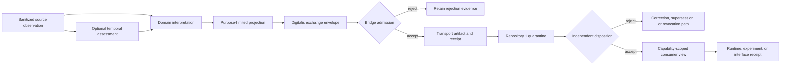

# Source-Observation Interpretation and Exchange Profile

## Status

**Candidate documentation profile only.** This document clarifies one possible bounded role for QSO-DIGITALIS in the A.L.I.S.T.A.I.R.E. evidence path. It does not approve the Digital Consciousness Field charter, establish a schema package, create a runtime or store, authorize transport, issue capabilities, accept evidence as true, or make any record canonical.

## Problem

The portfolio now has increasingly clear local responsibilities:

- QSO-SEEKER retrieves, sanitizes, attributes, and emits inert source-observation records;
- temporal-invariants candidates may assess time identity, ordering, uncertainty, freshness, and replay risk;
- Bridge may carry approved artifacts and produce transport receipts;
- Repository `1` is the candidate independent quarantine, capability, canonical-state, revocation, and recovery authority;
- QuantumStateObjects and QSO-FABRIC consume accepted evidence under bounded runtime or experiment rules;
- QSO-STUDIO and AionUi display evidence and decisions without becoming authority.

A missing interface remains between a source observation and a consumer-ready, purpose-limited evidence view. Without a separately identified interpretation and exchange layer, one record can be forced to mean all of the following at once:

1. what the source produced;
2. when and for which subject it applies;
3. what a domain interpreter inferred;
4. which fields a particular consumer may see;
5. what was transported successfully;
6. what Repository `1` accepted as canonical;
7. what a runtime or interface displayed.

That collapse is a gluing obstruction. It allows transport success to appear as truth, a derived interpretation to overwrite source evidence, a policy projection to become the canonical record, or a display state to be mistaken for authorization.

## Candidate role

QSO-DIGITALIS is evaluated as the owner of an **inert, content-addressed interpretation and policy-projection envelope** between accepted source records and downstream transport or consumption.

Under this candidate role, QSO-DIGITALIS may define how to:

- reference an immutable source-observation record without replacing it;
- attach separately identified temporal, domain, quality, and uncertainty assessments;
- produce purpose-, sensitivity-, retention-, and consumer-limited projections;
- bind every derived artifact to exact inputs, policy identities, transformation declarations, and hashes;
- carry correction, supersession, revocation, freeze, and recovery references;
- expose deterministic records for independent validation by Bridge, Repository `1`, runtimes, experiments, and interfaces.

QSO-DIGITALIS would not own source retrieval, temporal truth, operational credentials, generic network transport, Repository `1` canonical state, runtime execution, experiment authority, user-interface approval, or release/deployment authority.

## Identity separation

Every stage retains a distinct identity.

| Record | Meaning | Candidate owner | Must not imply |
|---|---|---|---|
| `source_record_id` | Immutable sanitized source observation | QSO-SEEKER or approved producer | Truth, freshness, permission, or canonical acceptance |
| `temporal_assessment_id` | Clock, ordering, freshness, replay, and uncertainty assessment | Approved temporal authority | Domain truth or operational authorization |
| `interpretation_id` | Domain-specific derived assessment | Named profile owner | Mutation of the source record or canonical state |
| `projection_id` | Purpose- and consumer-limited view | QSO-DIGITALIS profile | Additional rights beyond its policy scope |
| `exchange_envelope_id` | Content-addressed package of references and declarations | QSO-DIGITALIS profile | Delivery, truth, or canonical admission |
| `transport_artifact_id` | Artifact admitted for transport | Bridge or approved transport | Canonical acceptance or permission |
| `delivery_receipt_id` | Evidence of a bounded delivery attempt/result | Bridge or transport provider | Correctness of content or downstream acceptance |
| `disposition_id` | Independent Repository `1` quarantine decision | Repository `1` candidate | Execution success or universal truth |
| `consumption_receipt_id` | Evidence that a runtime, experiment, or interface used a view | Consumer repository | Canonical promotion or new authority |

No identifier aliases another record class. Cross-record linkage uses explicit typed references and digests.

## Candidate record family

### Interpretation record

An interpretation record references, but never rewrites, one or more source records.

Required fields should include:

- `profile_id` and `profile_version`;
- `interpretation_id`;
- `source_record_refs` with exact digests;
- optional `temporal_assessment_refs`;
- `subject_refs` and declared subject namespace;
- `interpreter_identity` and implementation/version reference;
- `generated_at`, clock source, and uncertainty where applicable;
- `claims`, `findings`, or `classifications` using a versioned vocabulary;
- confidence or uncertainty semantics with declared scale;
- evidence basis and transformation declaration;
- limitations, unsupported conditions, and completion state;
- sensitivity, purpose, retention, and disclosure classification;
- correction, supersession, revocation, and freeze references;
- canonical serialization identifier and content digest.

### Policy projection

A projection is a deterministic view over accepted inputs. It does not alter the source or interpretation records.

Required fields should include:

- `projection_id`;
- exact input record references and digests;
- `projection_profile_id` and version;
- intended consumer class and purpose;
- allowed field set and redaction/transformation declarations;
- sensitivity ceiling and disclosure restrictions;
- retention and expiry;
- policy, consent, and approval references where required;
- completeness state: `COMPLETE`, `PARTIAL`, `UNSUPPORTED`, or `UNKNOWN`;
- reason codes for removed, unavailable, or unverifiable fields;
- output digest and deterministic replay information.

### Exchange envelope

The exchange envelope packages typed references and the minimum policy context required for downstream validation.

Candidate fields:

- envelope type and version;
- envelope identity;
- producer identity and exact implementation reference;
- source, temporal, interpretation, and projection references;
- subject and consumer namespaces;
- purpose, sensitivity, retention, expiry, and disclosure policy;
- lineage graph digest;
- canonical serialization and envelope digest;
- correction, revocation, freeze, and recovery references;
- expected downstream route and accepted profile versions;
- limitations and non-authority declaration.

The envelope remains inert. It contains no executable payload, credential, unrestricted URL fetch instruction, repository mutation instruction, payment authority, or implicit capability grant.

## Candidate state machine

Each transition creates a new record. No stage mutates the evidence of an earlier stage.

## Responsibility boundaries

### QSO-SEEKER

Owns source acquisition, sanitization, attribution, raw-to-canonical source transformation, hostile-input controls, and source-specific completion evidence. It does not own downstream domain interpretation, policy projection, transport, or canonical disposition.

### Temporal authority

Owns time identity, clock model, uncertainty, ordering, freshness, expiry interpretation, and replay assessment. QSO-DIGITALIS may reference these results but must not silently recompute or override them under an unrelated profile.

### QSO-DIGITALIS

Candidate owner of interpretation references, policy-limited projections, content-addressed exchange envelopes, lineage declaration, and deterministic replay of those derived artifacts. It does not declare source truth or issue operational capabilities.

### Bridge

Owns bounded admission, transformation declarations, transport artifact identity, delivery attempt/result evidence, and correction/revocation propagation within its approved transport profile. It does not reinterpret evidence or make canonical decisions.

### Repository `1`

Candidate owner of quarantine, independent admission/disposition, capability issuance, canonical operational state, revocation, checkpoint, correction, and recovery authority. QSO-DIGITALIS envelopes are proposals or evidence inputs, never self-authorizing canonical records.

### QuantumStateObjects and QSO-FABRIC

Consume only exact accepted versions and hashes under separate capabilities. Runtime or experiment success produces evidence but does not retroactively validate source truth, interpretation quality, or canonical disposition.

### QSO-STUDIO and AionUi

Display and compare source, interpretation, projection, transport, and disposition identities separately. Interface presentation and user interaction do not become authority unless a separate approved action contract exists.

## Canonicalization and digest scopes

One digest cannot safely represent all stages. Candidate domain-separated digest scopes include:

- source record canonical bytes;
- temporal assessment canonical bytes;
- interpretation canonical bytes;
- projection canonical bytes;
- exchange-envelope canonical bytes;
- lineage graph;
- transported artifact bytes;
- delivery receipt;
- Repository `1` disposition;
- consumer receipt.

The digest input must include a domain tag, record type, schema/profile version, canonicalization identifier, and exact payload. A hash match proves byte-level identity under the declared method; it does not prove truth, authorization, freshness, or acceptance.

## Transformations

Every transformation is one of:

- `LOSSLESS_REPACKAGE` — content is preserved exactly, with only container changes;
- `NORMALIZED` — values are transformed under a declared deterministic normalization profile;
- `REDACTED` — fields are removed under a named policy;
- `AGGREGATED` — multiple inputs are summarized under a declared method;
- `DERIVED` — new claims or classifications are produced from evidence;
- `UNSUPPORTED` — the requested transformation cannot be performed safely.

The profile must identify which output fields are copied, normalized, redacted, aggregated, or derived. Undeclared transformations fail closed.

## Completion and uncertainty

A projection or interpretation cannot use one global success flag. Each check, claim family, or source group records:

- completion status;
- evidence availability;
- temporal status;
- confidence/uncertainty semantics;
- limitations;
- rejection or reason code;
- relevant source references.

`UNKNOWN`, `UNSUPPORTED`, `PARTIAL`, and `STALE` remain distinct from `PASS`, `VALID`, or `ACCEPTED`.

## Privacy and retention

The profile must preserve the most restrictive applicable source, subject, purpose, consent, legal, retention, and disclosure constraint.

Required controls:

- purpose limitation and consumer binding;
- data minimization before projection;
- explicit public, portfolio-internal, restricted, and secret classifications;
- source-license and downstream-use references;
- field-level or record-level redaction declarations;
- retention start, expiry, deletion/tombstone, and legal-hold semantics;
- correction and revocation propagation;
- no private data in public Pages, logs, workflow artifacts, URLs, or identifiers;
- fail-closed handling when privacy policy or consent evidence is missing.

A less restrictive downstream policy cannot downgrade a stricter source restriction.

## Correction, supersession, and revocation

Corrections and revocations create new immutable records. They do not erase prior evidence.

A correction must identify:

- the affected record;
- corrected or superseding record;
- reason code;
- authority and evidence;
- effective time and clock model;
- downstream caches, transports, dispositions, and consumers requiring invalidation or re-evaluation.

A revocation must propagate through Bridge caches and receipts, Repository `1` quarantine/canonical views, runtime or Fabric caches, and interface projections. Failure to prove propagation leaves the path frozen or `UNKNOWN`.

## Pairwise gluing fixtures

### QSO-SEEKER → QSO-DIGITALIS

- accepted source profile and digest;
- wrong record type or producer rejection;
- partial and unsupported collection preservation;
- hostile-input metadata retention;
- source-license and sensitivity preservation;
- correction and revocation linkage.

### Temporal authority → QSO-DIGITALIS

- accepted clock and freshness assessment;
- stale assessment rejection;
- conflicting clock-source handling;
- replay and duplicate distinction;
- uncertainty preservation;
- no silent timestamp substitution.

### QSO-DIGITALIS → Bridge

- accepted envelope version and canonical bytes;
- undeclared transformation rejection;
- privacy downgrade rejection;
- wrong consumer or route rejection;
- expired or revoked envelope rejection;
- lineage and digest mismatch rejection.

### Bridge → Repository `1`

- delivery receipt does not equal canonical acceptance;
- duplicate delivery deduplication;
- partial-delivery and retry semantics;
- correction/revocation propagation;
- wrong subject or policy rejection;
- transport transformation verification.

### Repository `1` → consumers

- exact disposition and capability binding;
- wrong consumer, purpose, version, or hash rejection;
- expired/revoked capability rejection;
- consumer receipt without canonical self-promotion;
- cache invalidation after correction or revocation.

## Triple-overlap witnesses

Required candidate witnesses include:

1. **Seeker → temporal authority → Digitalis** — the same source and subject identities, clock semantics, freshness, replay status, and limitations survive interpretation.
2. **Seeker → Digitalis → Bridge** — source bytes and lineage remain verifiable while every derived or transport transformation is declared.
3. **Digitalis → Bridge → Repository `1`** — transport success remains separate from quarantine admission and canonical disposition.
4. **Digitalis → Repository `1` → QuantumStateObjects** — a capability-scoped view binds the exact accepted envelope, policy, consumer, and expiry.
5. **Digitalis → Repository `1` → QSO-FABRIC** — experiment evidence references accepted records without converting experiment outcomes into source truth.
6. **Correction authority → Digitalis → Bridge/Repository `1`** — correction and revocation invalidate projections, caches, receipts, and dispositions consistently.
7. **Repository `1` → QSO-STUDIO/AionUi → human review** — interfaces display source, interpretation, projection, transport, and disposition as distinct states.
8. **Emergency stop → Digitalis store/profile → downstream caches** — frozen records cannot be newly projected, transported, admitted, or consumed until explicit recovery.

## Material obstructions

### O-DIG-01 — Source and interpretation identity collapse

A derived interpretation can be mistaken for the source record if identities and digest domains are reused.

**Repair candidate:** immutable typed references, separate IDs, domain-separated hashes, and UI labels for source versus derived claims.

### O-DIG-02 — Temporal authority overlap

If Digitalis calculates freshness or replay independently, its result may conflict with temporal-invariants profiles or Repository `1` admission policy.

**Repair candidate:** temporal assessments are external typed inputs under a designated owner; Digitalis preserves but does not silently override them.

### O-DIG-03 — Generic envelope ownership conflict

QSO-GENOMES, QSO-FABRIC, QSO-SEEKER, Bridge, Repository `1`, and QSO-DIGITALIS all describe envelopes or registries. Multiple generic owners can create incompatible canonicalization and migration rules.

**Repair candidate:** designate one neutral envelope/profile registry owner; QSO-DIGITALIS owns only its interpretation/projection profile.

### O-DIG-04 — Transport and exchange overlap

Draft field language can be read as granting Digitalis transport or service authority, overlapping Bridge.

**Repair candidate:** Digitalis emits inert exchange envelopes; Bridge owns separately approved admission and transport semantics.

### O-DIG-05 — Content-addressed store and canonical-state overlap

Content-addressed local evidence storage can be mistaken for Repository `1` canonical operational state.

**Repair candidate:** Digitalis storage, if ever approved, is a derived-artifact cache or evidence store only; Repository `1` disposition remains separately identified and authoritative.

### O-DIG-06 — Projection as capability

A policy-limited view may be mistaken for authorization to act.

**Repair candidate:** projections carry non-authority declarations; operational capabilities are separate Repository `1` records bound to a consumer, action, scope, and expiry.

### O-DIG-07 — Privacy downgrade across derived views

Aggregation or redaction can accidentally expose protected facts or weaken source restrictions.

**Repair candidate:** most-restrictive-policy inheritance, deterministic redaction fixtures, inference-risk review, and fail-closed public projection.

### O-DIG-08 — Correction and cache divergence

Corrected or revoked evidence may remain active in Digitalis projections, Bridge caches, Repository `1` views, runtimes, experiments, or interfaces.

**Repair candidate:** one versioned correction/revocation propagation contract with bounded proof of cache invalidation and re-evaluation.

### O-DIG-09 — Consciousness terminology ambiguity

The phrase “Digital Consciousness Field” can imply consciousness, awareness, personhood, or autonomous authority that the repository does not establish.

**Repair candidate:** preserve the term only as an architectural label, pair it with explicit non-claims, or adopt a clearer product name during P0 disposition.

## Lowest-coupling charter candidate

The lowest-coupling candidate is:

> QSO-DIGITALIS defines a non-executing, content-addressed interpretation, policy-projection, and exchange-envelope profile for accepted evidence. It preserves source identity and lineage, references external temporal assessments, declares all transformations, and creates purpose-limited consumer views. It does not retrieve sources, validate truth, issue operational capabilities, transport artifacts, own canonical operational state, execute runtimes, approve experiments, publish externally, or deploy services.

This candidate may be approved, revised, split into a neutral contract package, or rejected in favor of retirement. Documentation does not make the decision.

## Required decisions

P0 disposition must explicitly assign:

1. neutral envelope and profile-registry ownership;
2. source, subject/device, temporal, interpretation, projection, transport, disposition, and consumer identity namespaces;
3. canonical serialization, domain-separated hashing, and signing method;
4. reason-code, transformation, confidence, and completion vocabularies;
5. privacy, source-license, retention, correction, revocation, freeze, and recovery ownership;
6. whether Digitalis owns a local derived-artifact cache, only schemas/profiles, or no active capability;
7. the exact Seeker → temporal/Digitalis → Bridge → Repository `1` route;
8. migration, cache invalidation, incident, emergency-stop, rollback, release, and retirement authority.

## Scope boundary

This profile adds documentation only. It does not establish schema compatibility, approve PR #2, run the scaffold materializer, create or mutate records, fetch external data, transport artifacts, store private data, sign content, issue credentials or capabilities, publish Pages, release a package, or deploy a service.
